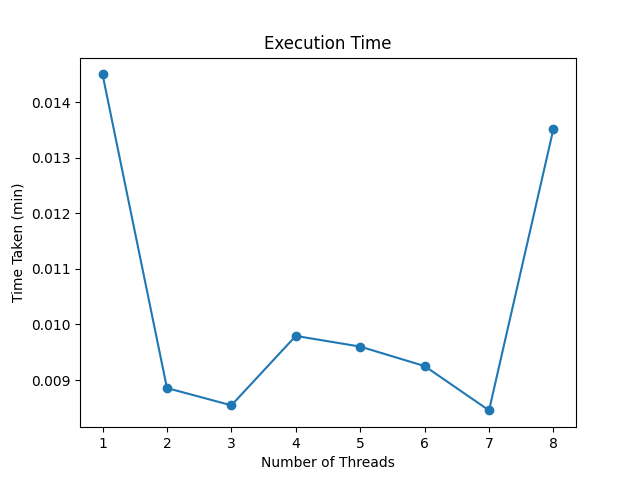
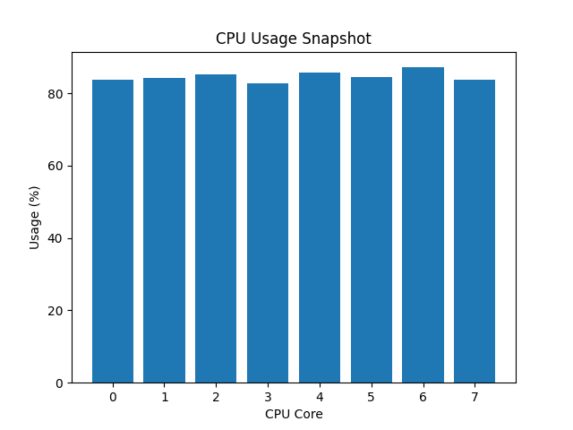
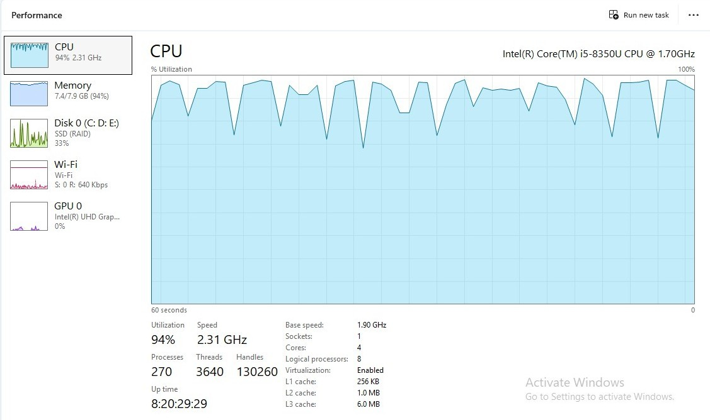

# Matrix Multiplication Performance

Simple project to test multithreaded matrix multiplication in Python and save results.

## What this project does

- Generates a random matrix and multiplies it with a constant matrix
- Runs the experiment with different thread counts
- Saves timing results in `results/execution_times.csv`
- Saves a performance graph in `results/execution_graph.png`
- Saves a CPU usage graph in `results/cpu_usage.png`
- Optional Task Manager screenshot: `results/cpu_taskmanager.jpeg`

## Files to check

- `src/matrix_multiplication.py` — main script
- `results/execution_times.csv` — timing results for each thread count
- `results/execution_graph.png` — threads vs time graph
- `results/cpu_usage.png` — CPU usage graph from the script
- `results/cpu_taskmanager.png` — Task Manager screenshot during the experiment

## Quick run

```bash
cd src
python matrix_multiplication.py
```

## Execution times

See the timing results in [`results/execution_times.csv`](results/execution_times.csv).

## Graphs

### Execution time graph


### CPU usage graph


### Task Manager screenshot

